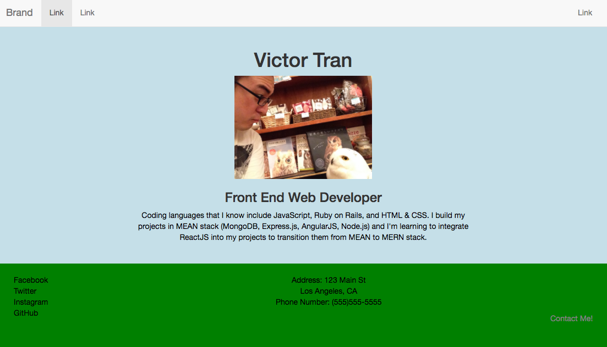

#Tutoring

##HTML and CSS - A 2017 lesson plan for Chie and Sachiko

##Lesson goals:

Make a simple HTML + CSS page to introduce yourself

**HTML elements**

- tags
  - doctype, html, title, head, body, div, p, h1-h6, img, ul, li, a href
- classes and their attributes
  - classnames
- id's and their attributes
  - id names

**CSS elements and media queries**
- how to style in-line
- how to style in a separate css file
- select by class, select by id

#Homework time!

##Your first homepage
Try to make your website look like the above screenshot.
- Pay attention to where you want your image, navigation bar (navbar), footer, and text boxes to appear on the page.
- Remember, everything you see on the internet is a series of boxes. On your Macbook, use Google Chrome's element inspector **(⌘ + Shift + C)** or the console tool **(⌘ + option + J)** to check the properties of each element.
- **Use Google** if you get stuck! Developers use it all the time.
- If you get really stuck, just shoot me a message on Facebook or at murtato@gmail.com

#GOOD LUCK!!!

*Big hint: click the files listed above to read them ;)*
